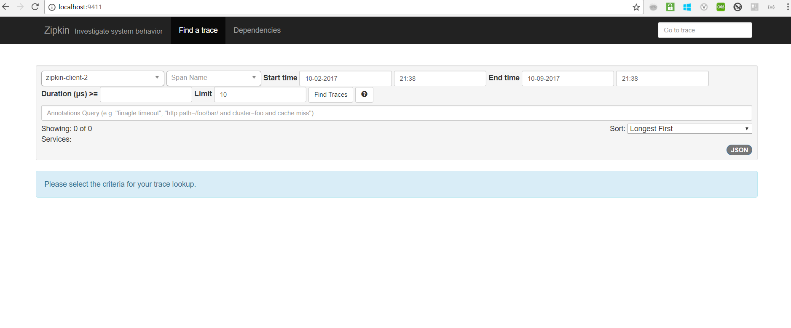

# spring-cloud-sidecar-sample
This project contains samples demonstrating the microservices tracing using zipkin.

### ZIPKIN 

<i>Distributed Tracing system to trace the request across services in microservices architecture.</i>

### ZIPKIN UI

Navigate to http://localhost:9411 to view Zipkin UI.



<table>


 <tr>
    <th style="text-align:left">Name</th>
    <th style="text-align:left">Port</th> 
    <th style="text-align:left">Description</th>
  </tr>
  <tr>
    <td><a href="https://github.com/BarathArivazhagan/spring-cloud-zipkin-tracing/tree/master/zipkin-ui-server"> zipkin-ui-server</a></td>
    <td>9411</td>
    <td>Zipkin UI server</td>
  </tr>
  <tr>
    <td><a href="https://github.com/BarathArivazhagan/spring-cloud-zipkin-tracing/tree/master/zipkin-client-1">zipkin-client-1</a></td>
    <td>8081</td>
    <td>Client application</td>
  </tr>
  <tr>
    <td><a href="https://github.com/BarathArivazhagan/spring-cloud-zipkin-tracing/tree/master/zipkin-client-2">zipkin-client-2</a></td>
    <td>8082</td>
    <td>Client application</td>
  </tr>
 
  
</table>


## How to build and run ?

 * Download/Clone the repository : 
   
   ```
   ./mvnw clean install

   ```

 * To run the application :

	  ```
	  docker-compose up

	  ```

## How to test the application ? 


<div>
	<span>Navigate to http://localhost:8081/client  Client 1 --> Client 2 interaction</span><br>
    <span>Navigate to http://localhost:8082/client   Client 2 --> Client 1 interaction </span>
</div>


## How to rebuild the project after the changes? 

```
  docker-compose build

```


